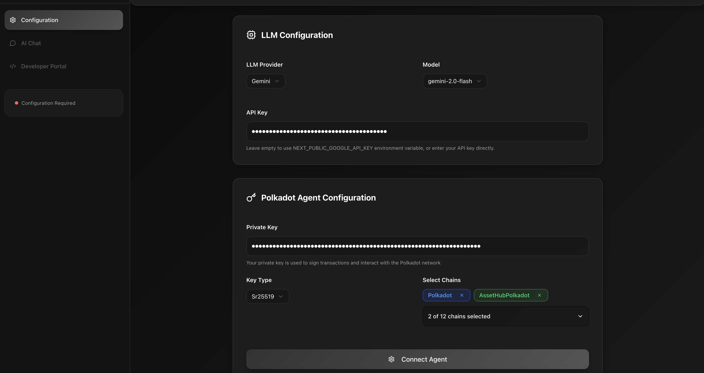
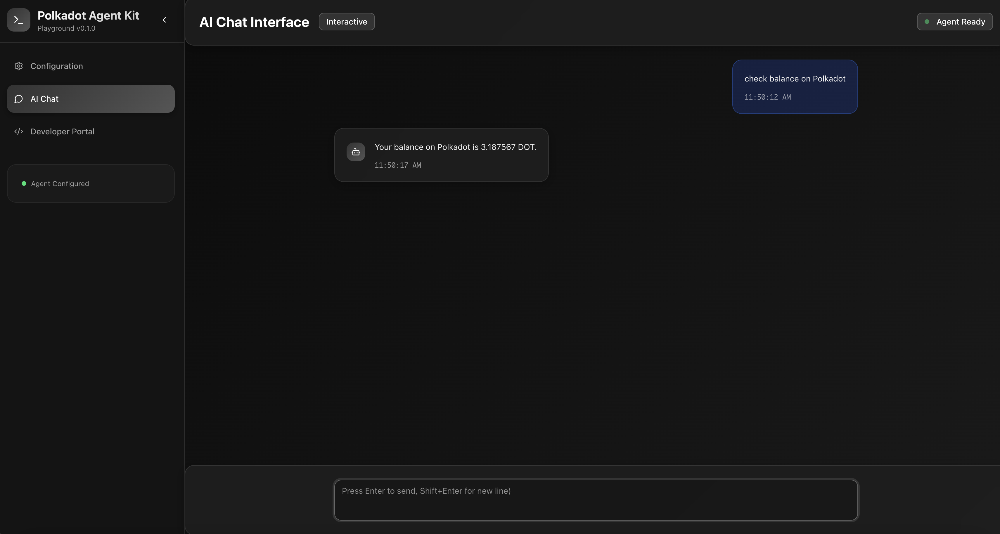
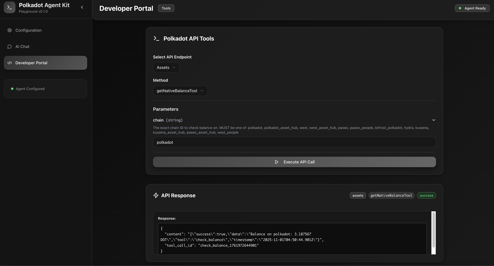

# Polkadot Agent Playground

A modern, interactive web application that provides a comprehensive environment for exploring, testing, and interacting with the Polkadot ecosystem through AI-powered agents.

## Features

### 🔧 **Configuration Management**
- LLM provider selection and configuration
- Polkadot agent setup (private key, key type, chains)

<Frame>
  
</Frame>


### 🤖 **AI Chat Interface**
- Multi-LLM provider support (Ollama, OpenAI, Google GenAI)
- Real-time conversation with context-aware responses
- Tool calling and execution through LangChain agents


<Frame>
  
</Frame>


### 👨‍💻 **Developer Portal**
- Interactive API endpoint explorer
- Direct tool execution with parameter validation
- Schema-based form generation from tool definitions
- Real-time API response display

<Frame>
  
</Frame>


## Installation

### Prerequisites

- **Node.js** 20+ and **pnpm**
- For **Ollama**: Local Ollama installation and running service
- For **OpenAI**: Valid OpenAI API key
- For **Gemini**: Valid Google Gemini API key
- **Polkadot Account**: Private key for blockchain operations

### 1. Clone the repository

```bash
git clone <your-repo-url>
cd polkadot-agent-kit/apps/playground
```

### 2. Install dependencies

```bash
pnpm install
```

### 3. Set up environment variables (optional)

Create a `.env.local` file in the playground directory:

```env
NEXT_PUBLIC_OPENAI_KEY=
NEXT_PUBLIC_GOOGLE_API_KEY=
```

### 4. Start the development server

```bash
pnpm run dev
```

The application will be available at `http://localhost:3000`

## Contributing

Contributions are welcome! Areas for improvement:

- Additional LLM provider support
- Enhanced error messages and user feedback
- More developer tools and utilities
- Improved mobile experience
- Additional documentation and examples


## License

Apache-2.0


## Related Resources

- [LangChain Documentation](https://js.langchain.com/)
- [Next.js Documentation](https://nextjs.org/docs)
- [Radix UI Documentation](https://www.radix-ui.com/)

---

## Support

For issues, questions, or contributions:

- **GitHub Issues**: Report bugs and request features
- **Documentation**: Check main README and package documentation
- **Examples**: Review Telegram Bot and MCP Server examples

---

For more details, explore the source code in the respective directories.
